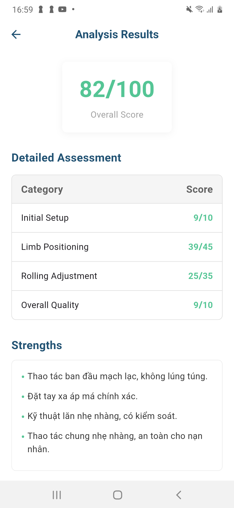
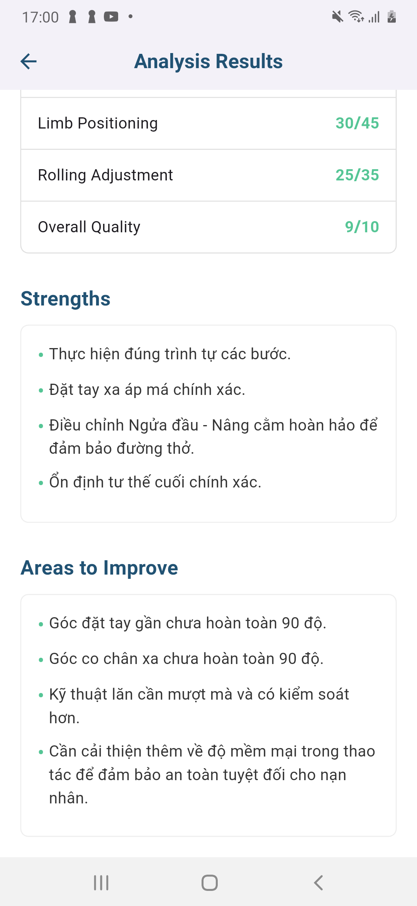

## Getting Started

To run any Android application built with Flutter you need to configure the enviroments in your machine, you can do this following the the tutorial provided by Google in [Flutter website](https://flutter.dev/docs/get-started/install)

- Flutter SDK
- Android Studio (to download Android SDK)
- Xcode (for iOS develop only)
- Any IDE with Flutter SDK installed (ie. IntelliJ, Android Studio, VSCode etc)
- A little knowledge of Dart and Flutter

## Technologies

- Flutter
- Clean Architecture
- GetX
- Firebase (Authentication, Firestore)
- Hive (Local Storage)
- Camera & Video Player
- Device Preview
- Google Fonts

## Setup

1. Clone the repository
2. Open the project in your preferred IDE (e.g. Android Studio, VS Code)
3. Run `flutter pub get` to install the required dependencies
4. Run the project in an emulator or on a physical device

# Architecture

The Flutter codebase follows Clean Architecture principles, a design philosophy that emphasizes separation of concerns and maintainability.


# Project Structure

```
- lib/
  - assets/: Contains application resources
    - icons/: Contains application icons

  - config/: Application configuration
    - routes/
      - app_pages.dart: Routes to corresponding pages
      - app_routes.dart: Contains names of routes
    - theme/: Contains application theme
    - languages/: Contains application translations

  - core/: Application core
    - errors/: Error handling (exceptions, failure, etc.)
    - network/: Network information (check internet connection, etc.)

  - features/: Application features following Clean Architecture
    - data/: Data layer
      - datasources/: Data sources (local, remote)
      - models/: Models for data
      - repositories/: Repository implementations

    - domain/: Domain layer
      - entities/: Application entities
      - repositories/: Repository interfaces
      - usecases/: Application usecases

    - presentation/: Presentation layer
      - global_widgets/: Widgets used throughout the application
      - modules/: Functional modules
        - auth/: Authentication module
          - login/: Login
            - screens/: Login screens
            - widgets/: Widgets only used in login module
            - login_controller.dart: Controller for login
            - login_binding.dart: Binding for login
          - register/: Registration
          - auth_controller.dart: Common controller for auth
        - dashboard/: Dashboard module
        - event/: Event module
        - feedback/: Feedback module
        - lesson/: Lesson module
        - profile/: Profile module
        - quiz/: Quiz module

  - main.dart: Application entry point
```

## Screenshots

### Authentication

<p align="center">
  
  
</p>

### Dashboard

<p align="center">
  
  
  
  
  
  
  
  
</p>


### Quiz

<p align="center">
  
  
  
  
</p>

### Events

<p align="center">
  
  
</p>

### Profile

<p align="center">
  
  
</p>

# References

[Frontend repository](https://github.com/nphng15/learn2aid_frontend)

[Backend repository](https://github.com/iknizzz1807/learn2aid)

[Design Figma](https://www.figma.com/design/0DlAWkeCkaBWB6GPitgNzD/HACKATHON---2025---GDSC?node-id=3-31&t=DjYH5w7JbaWoxkGV-1)
